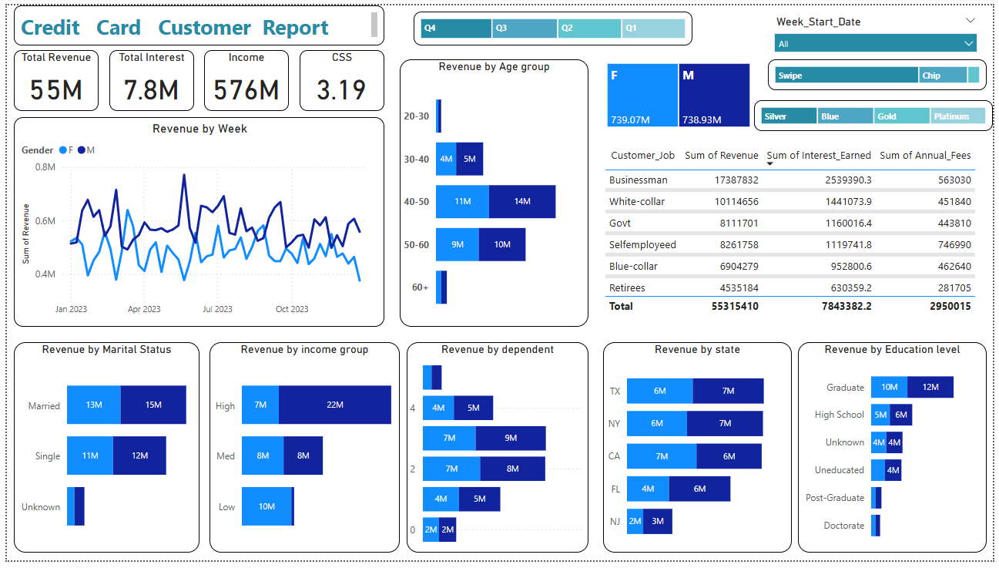

# 💳 Credit Card Customer Insights Dashboard

This Power BI dashboard project visualizes and analyzes customer data and credit card transaction trends using two datasets: `creditcard.csv` and `customer.csv`. The dashboard is designed to help stakeholders understand key patterns in revenue generation, customer segmentation, card usage behavior, and transaction metrics.

---

## 📂 Dataset Overview

### 1. `creditcard.csv`
Contains transactional and product-related data:
- **Client_Num**: Unique customer ID
- **Card_Category**: Card tier (e.g., Blue, Silver, Gold, Platinum)
- **Annual_Fees**, **Activation_30_Days**, **Customer_Acq_Cost**
- **Total_Trans_Amt**, **Total_Trans_Vol**, **Interest_Earned**
- **Use Chip**, **Exp Type** (Bills, Entertainment, etc.)
- **Date columns**: `Week_Start_Date`, `Week_Num`, `Qtr`

### 2. `customer.csv`
Includes demographic and account-level customer details:
- **Customer_Age**, **Gender**, **Dependent_Count**
- **Education_Level**, **Marital_Status**, **Customer_Job**
- **Income**, **Cust_Satisfaction_Score**
- **State, Car_Owner, House_Owner, Loan status**

---

## 📊 Dashboard Features

### 🔵 Page 1: Customer Analysis

- **Total Metrics**: Revenue, Interest, Income, and Customer Satisfaction Score (CSS)
- **Revenue Trends**:
  - Weekly revenue trends by gender
  - Revenue segmented by:
    - Age group
    - Marital status
    - Education level
    - Income group
    - State
    - Dependents
    - Job type
- **Gender-based Revenue Comparison**
- **Customer Job Breakdown with Revenue, Interest & Fees**

---

### 🟢 Page 2: Transaction Analysis

- **KPIs**: Total Revenue, Interest, Transaction Amount, Transaction Count
- **Breakdowns**:
  - Revenue by **Card Category**, **Use Type** (Swipe, Chip, Online)
  - Revenue by **Expense Type** (Bills, Fuel, Travel, etc.)
  - Quarterly trend of Revenue vs Transaction Volume
- **Customer Segments**:
  - Revenue by Education Level
  - Revenue by Customer Job

---

## 🔧 Key Insights
- **Blue cardholders** contribute the most revenue.
- **Swipe transactions** significantly outperform Chip or Online in revenue.
- **Businessmen** and **Graduates** are top contributors by customer type and education.
- **Age group 40–50** drives the highest revenue.
- **Transaction volume** peaked in **Q3** while revenue remained relatively consistent.

---

## 🧰 Tools Used
- **Power BI Desktop** for dashboard development
- **CSV files** as data sources
- **DAX** for calculated metrics and slicers

---

## 🧠 Learning Objectives
- Build interactive dashboards from raw data
- Apply slicers and filters for dynamic analysis
- Identify customer behavior trends using visual storytelling

---

## 📌 Author Notes
This project is developed for learning and portfolio purposes. Ideal for showcasing Power BI visualization skills and understanding of customer segmentation in financial services.
